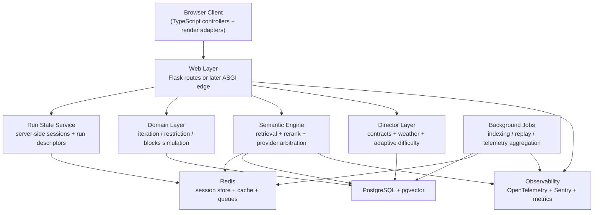

# War Room - Virtual Council

This document is intentionally expansive. It is not a pitch deck, a short
strategy memo, or a lightweight wishlist. It is a grounded technical expansion
document derived from the current Semantris Plus codebase, including
`app.py`, `game_logic.py`, `game_logic_restriction.py`,
`game_logic_blocks.py`, `llm_client.py`, `semantic_cache.py`,
`settings.py`, `persistence.py`, the TypeScript controllers and renderers
under `frontend/src/`, the Jinja shells under `templates/`, the tests under
`tests/`, the Playwright suite, and the current PRD and iteration packets.

The goal of the "Virtual Council" section is to deliberately widen the design
space before convergence. Each voice below is opinionated on purpose. The final
sections will synthesize the ideas into a coherent expansion roadmap that
respects the current project reality: this is already a playable three-mode
semantic arcade, not a blank slate.

## Agent Alpha - The Algorithms & Engine Lead

The current engine is small, readable, and computationally light enough for its
present board sizes, but it is already exposing where scale will hurt first.
Iteration Mode is fundamentally dominated by remote semantic ranking latency,
not by CPU time inside `resolve_turn()`. The actual pure-Python turn resolver in
`game_logic.py` is cheap: reversing ranked indices, slicing the destruction
zone, sampling unseen indices, and updating a small state dictionary are all
effectively \( O(n) \) in the visible board size. With `MAX_BOARD_SIZE = 20`,
that is trivial. The hidden problem is that the engine recomputes more global
state than it needs to as vocabulary size grows. `draw_unseen_indices()` walks
the entire vocabulary to reconstruct availability, `_used_index_set()` decodes a
hex bitmask back into indices each time, and every turn still routes through a
full ranking call over the visible board. That is fine for a few hundred words.
It becomes the wrong asymptotic profile if you want thousands of vocabulary
items, dynamic pack blending, seasonal content injection, or live challenge
modifiers that sample from large corpora.

Blocks Mode is where the next real algorithmic frontier begins. The current
implementation in `app.py` plus `game_logic_blocks.py` is clever and practical:
choose a primary candidate through a tournament-style narrowing phase, score the
frontier in waves, then run a four-neighbor flood-fill to discover the chain,
apply gravity column by column, and refill. For the current `8 x 10` board with
32 occupied cells, the performance is more than adequate. But the algorithmic
shape is already visible. The traversal queues use Python lists with `pop(0)`,
which is acceptable at tiny sizes but wrong for expansion. Frontier scoring is
repeated LLM batch work over structurally similar neighborhood queries. Gravity
rebuilds full columns rather than diffing dirty regions. The renderer maps block
identity by `word`, which works only because vocabulary entries are globally
deduplicated and visible duplication is carefully avoided. The current system is
good enough to ship. It is not yet the engine you want for larger boards, rival
ghost paths, weather fields, chain modifiers, or simulated NPC runs.

The rendering logic is also quietly more important than it looks. The
frontend-side FLIP-style transition in `frontend/src/animations.ts` and
`frontend/src/blocks_animations.ts` uses DOM layout measurements and reuses
existing nodes when it can. That gives the game a respectable sense of motion
without a canvas or game engine, but it is still layout-bound. Every major
transition triggers DOM reads and writes in the same frame family. On the
current board sizes, that is fine. On larger surfaces, simultaneous particle
effects, semantic overlays, chain previews, ghost rivals, and weather modifiers,
the present DOM model becomes the bottleneck. My radical view is that the
project should not jump straight to a heavy engine, but it should begin an
engine-layer split: pure deterministic simulation in data-oriented arrays or
typed buffers, a thin renderer adapter, and a strict distinction between
"simulation state," "animation state," and "presentation state."

My first radical proposal is a hierarchical semantic retrieval cascade. Right
now the system asks the primary ranker to reason directly over visible words or
candidate batches. That works because the surface is still small. If Semantris
Plus grows into daily challenges, pack fusion, rival lanes, longer grids, or
meta objectives, the game should stop thinking of ranking as one call and start
thinking of it as a pipeline: pre-normalize clue tokens, query a local
approximate-nearest-neighbor index for candidate narrowing, rerank with a
learned or rules-based semantic scorer, then invoke the expensive LLM only for
tie-breaks or high-uncertainty edges. This is not abstract overengineering. It
is the direct way to reduce cost, reduce latency variance, and make semantic
behavior more deterministic without losing the flavor of an LLM-backed system.

My second radical proposal is to replace the current bitmask-and-list engine for
large-scale sampling with a hybrid of compressed bitsets and indexed samplers.
The present `used_mask` representation is elegant for the current game because
it serializes compactly into session state. But as soon as packs grow and runs
persist longer, you want a structure that supports fast membership, fast random
draw without full rescans, and efficient set algebra for challenge conditions.
A Fenwick tree over active counts, a Roaring Bitmap, or even a two-level sparse
availability structure would let the game sample unseen words in
sublinear-to-logarithmic time while also supporting pack overlays, exclusions,
and event-based word pools. That opens the door to procedural pack mutation,
weather-based vocabulary injections, and replay-perfect seeded runs without
turning every draw into a full vocabulary scan.

My third radical proposal is to give Blocks Mode a true local field solver.
Instead of repeatedly rediscovering frontier structure from scratch each turn,
maintain connected-component metadata, dirty-column markers, and reusable cell
adjacency maps in typed arrays. Once that exists, you can add systems the
current design cannot support cleanly: chain previews while typing, shockwave
propagation rules, cell modifiers, corruption zones, unstable blockers, gravity
anomalies, and dual-anchor clears. The board then stops being a static puzzle
surface and becomes a dynamic simulation field. That is the moment Blocks Mode
stops being "the other mode" and becomes a major pillar of the game.

## Agent Beta - The Architecture & Stack Lead

The strongest architectural fact in this repository is not that it uses Flask,
TypeScript, or SQLAlchemy. It is that Semantris Plus is already a modular
monolith with one dangerous exception: state orchestration is still too
centralized. `app.py` is the command post for routes, vocabulary pack loading,
mode selection, serialization, persistence metadata, and significant turn
orchestration, especially for Blocks Mode. `llm_client.py` is the other command
post, holding prompts, schemas, parsers, provider wrappers, debug traces,
fallback systems, cache integration, and startup probing. Everything else is
surprisingly disciplined. The gameplay cores are isolated in `game_logic.py`,
`game_logic_restriction.py`, and `game_logic_blocks.py`. The frontend has
mode-specific controllers. The tests are aligned with these ownership zones.
That means the project is already one good refactor away from being a healthy
production-scale modular monolith. It does not need a ceremonial rewrite to get
there.

The most important stack issue is hidden in plain sight: Flask's default
session mechanism means the run state is sitting inside a signed client cookie.
Today that is acceptable because the state is compact: board indices, a target
index, some counters, a used-word mask, maybe a grid array, and persistence
metadata. Tomorrow it becomes a hard limit. As soon as you introduce meta
progression, rival ghosts, weather fields, seeded challenge descriptors, or
replay markers, the state volume and mutation rate will exceed what a cookie
session should carry. Even before size becomes catastrophic, cookie-backed state
makes observability, conflict resolution, anti-cheat validation, and analytics
needlessly awkward. My opinion is blunt: the first truly production-grade stack
upgrade is not a framework swap. It is a move from cookie-backed run state to a
server-side run ledger keyed by `run_id`.

The definitive future stack should be layered, incremental, and ruthless about
responsibilities. Keep Python for the simulation and semantic layers; that is
where the repo is already strong. Keep server-rendered shells for the current
app because the page structure is simple and fast. Move durable state to
PostgreSQL, move ephemeral hot state to Redis, move semantic retrieval to a
vector-capable subsystem such as `pgvector` or Qdrant, and split the monolith by
responsibility rather than by marketing category. I would target a modular
layout like `domain/`, `application/`, `infrastructure/`, `web/`, and
`semantic_engine/`, with explicit DTOs at the edges. This lets the product stay
small and understandable while preparing it for background jobs, replay
processing, telemetry enrichment, and possible future multiplayer or seasonal
content without forcing the entire UI into SPA architecture.

On the frontend, the present TypeScript DOM model is acceptable and even
pleasant. What it lacks is an intermediate client-state layer. Right now the
controllers own timing, fetch orchestration, state mutation, HUD updates, and
animation sequencing. That is workable because there are only three modes. It
becomes brittle as soon as each mode gains multiple substates, field effects,
opponents, or meta hooks. I do not think the game needs React immediately. I do
think it needs a deterministic client store abstraction, shared transport
helpers, and render adapters. If a framework is introduced later, it should be a
response to component entropy, not a reflex. Vite becomes attractive sooner than
React does; server-side sessions become attractive sooner than FastAPI does;
OpenTelemetry becomes attractive sooner than Kubernetes ever will.

My radical stack idea is to treat Semantris Plus as a game-service platform even
while it remains single-player. That means every completed run becomes a durable
record, every turn can optionally emit a normalized event, and semantic ranking
becomes a service with explicit contracts and replayability. Once that exists,
you gain ghost runs, challenge seeds, debug replays, balance telemetry,
difficulty tuning, cached leaderboards, pack analytics, and AI coach features
without retrofitting every one of them from scratch. This can still live inside
one repository. But the boundaries must become real.

The CI/CD target is equally clear. GitHub Actions should become the baseline:
Python unit tests, TypeScript check, Vitest, Biome, Playwright in fake-ranker
mode, migration validation, and packaging verification. Add Docker with a
multi-stage build only after the server-side session and database migration
story is stable. Add Sentry and OpenTelemetry before adding a second deployment
environment. Add Postgres before adding complex seasonal systems. In other
words: production readiness is not "cloud first." It is "contracts, durability,
traceability, and repeatable builds first."

## Agent Gamma - The Gameplay Visionary

The strongest thing about Semantris Plus is that it already has three loop
shapes, not one: the clean target-pull puzzle of Iteration Mode, the legality
pressure of Restriction Mode, and the local chain-reaction topology of Blocks
Mode. That matters because the game is no longer asking "is semantic ranking
fun?" It has already answered that. The real design question now is how to turn
these loops into a world with forward momentum. At the moment, each run is
isolated. The player starts, clears or fails, and starts again. That is good for
rapid replay. It is not enough for long-term obsession. The next phase should
not simply add more words or more visual polish. It should add durable context:
reasons that today’s clue choice matters to tomorrow’s board, this week’s pack,
or this season’s objectives.

The first large design opportunity is a "semantic climate" layer sitting above
all three modes. Instead of every run being semantically neutral, each run can
be shaped by world conditions: a storm front that boosts kinship and physicality
words, a static field that dampens literal overlap, a celebrity eclipse that
makes entity-based clues stronger but riskier, a noise bloom that adds false
positives near polysemous words. This sounds decorative until you realize how
perfectly it maps onto the current mechanics. Iteration Mode gets board drift
and target volatility. Restriction Mode gets adaptive rule synergy or conflict.
Blocks Mode gets field-based combo thresholds and regional anomalies. Suddenly
the same vocabulary pack can feel different across runs without changing the
core interface.

The second opportunity is a real meta-progression economy, but not a generic
"gold and upgrades" layer. This game should reward semantic skill, not mere
playtime, so the economy has to be tied to expressive performance. Players could
earn "signal," "clarity," or "resonance" based on how efficiently they solve
boards, how rarely they fall back to safety heuristics, how well they navigate
restrictions, or how deeply they chain blocks. That resource then powers
loadouts, run modifiers, pack unlocks, seeded missions, rival ghost downloads,
weather stabilizers, or one-time tactical tools. A strong player should feel as
though they are curating their semantic style, not simply filling an XP bar.

The third opportunity is procedural narrative built from run structure rather
than cutscenes. Semantris Plus does not need a lore dump. It needs a campaign
frame in which factions, stations, or operators issue contracts that reinterpret
the same mechanics. One contract might demand low-latency tower clears under
interference. Another might ask the player to preserve specific vocabulary
clusters. Another might pit the player against a ghost rival whose preferred
semantic style biases the board climate. Restriction Mode becomes not just a
harder tower but a compliance mission. Blocks Mode becomes an excavation or
containment field. Iteration Mode becomes precision routing. The game acquires
meaning without abandoning its minimal input loop.

My radical design proposal is to stop treating vocabulary packs as static data
files and start treating them as living biomes. Each pack can have tags, latent
clusters, drift modifiers, event hooks, and difficulty fingerprints. That lets
you build daily maps, seasonal circuits, biome-specific weather, faction control
zones, and authored challenge paths using the exact same core mechanics. A pack
called `aviation_1.txt` stops being just a word list and becomes an airspace
with turbulence patterns, specialist rules, and rival houses. The game becomes
less "choose a pack" and more "enter a semantic territory."

My second radical proposal is to embrace rival presence. Not necessarily real
time, not necessarily synchronous multiplayer, but visible rival agency. Ghost
runs, asynchronous races, AI curators, and factional objectives create the
feeling of a living circuit. The game already captures enough state to begin
this: score, turns, elapsed time, warnings, provider traces, pack identity, and
mode. Add turn events and seeds, and the player can compete against the memory
of other runs. That instantly increases retention because it turns solitary skill
into comparative mastery.

## Agent Delta - The AI & NPC Logic Expert

At present, Semantris Plus has almost no NPC layer, but it has the perfect
foundation for one because the game is already fundamentally about decision
making under semantic constraints. The semantic provider is an oracle, the
player is an actor, and the board is a world state. That means NPC design here
should not start with characters walking around a map. It should start with
agents making meaningful run decisions. The simplest form is a rival runner:
given the same mode, seed, and pack, how would another agent optimize score,
safety, combo depth, or speed? The moment you can answer that, you get ghosts,
training partners, coach modes, faction representatives, contract generators,
and difficulty directors that feel alive because they are operating on the same
decision surface as the player.

The correct AI paradigm is not singular. Different subsystems want different
forms of intelligence. Rival run planning wants a Goal-Oriented Action Planning
style model or a heuristic search over run objectives. Tactical clue generation
wants retrieval plus ranking plus evaluation, not a behavior tree. Live tutorial
or coaching wants a policy model that observes errors and surfaces targeted
hints. Challenge generation wants a constraint solver. Seasonal balance wants
telemetry-driven learning. If the project collapses all of that into one "AI
module," it will become useless. The architecture should instead define an agent
contract with explicit observations, actions, objective functions, and replay
hooks.

The current code already suggests how to do this. `llm_client.py` has explicit
contracts for ranking, restriction judgment, scoring, blocks primary choice, and
blocks candidate scoring. Those can be wrapped as environment observations and
action evaluators. `game_logic.py`, `game_logic_restriction.py`, and
`game_logic_blocks.py` already expose deterministic state transitions. That
means you can simulate candidate actions offline. Once simulation exists, NPCs
cease to be decorative. A GOAP rival can evaluate "clear target in two turns,"
"avoid strike escalation," "maximize chain size in current field," or "preserve
rare biome words for contract bonus." A behavior tree can govern presentation
and personality. A small learned policy can personalize difficulty or choose
what type of rival appears next.

My first radical proposal is an AI Director that controls semantic climate,
contract distribution, and rival injection based on player skill signals. This
is not the same as dynamic difficulty in the shallow sense. It is closer to a
drama manager. The director observes average turn latency, strike rates, combo
depth, fallback frequency, repeated failure patterns, and pack familiarity. It
then chooses between safe missions, mastery missions, recovery missions, or
chaos events. The game begins to feel authored even when it is generated. The
player experiences rising tension, relief, escalation, and special events
without a human having to hand-script every sequence.

My second radical proposal is a coach/rival duality system. Every rival agent
should be capable of being replayed as a coach. If a rival clears a challenge in
12 turns, the same decision trace can be converted into a hint ladder:
"preferred clue family," "danger zone risk on turn 4," "why this chain was
expanded," "why a rule-safe clue was chosen over a high-volatility clue." That
turns AI from opaque opponent to explainable mentor. Semantris Plus is a perfect
candidate for that because clue choice can be narrated in semantic terms without
breaking the fantasy of the game.

My third radical proposal is to add pack-ecology NPCs rather than just run-rival
NPCs. Curators, smugglers, archivists, and auditors can all be implemented as
systems that modify available vocabulary, restrictions, weather, and economy.
One NPC might specialize in dense thematic packs and offer high-risk missions.
Another might stabilize weather but reduce reward. Another might inject noisy
polysemes that make clues more dangerous. These are AI actors because they are
choosing interventions based on world state and player history. The game world
then feels inhabited even though its core input remains beautifully simple:
type a clue, watch meaning move matter.

# idea.md - The Master Expansion Document

## Frame

This document synthesizes the Virtual Council into an executable expansion
direction for Semantris Plus. It assumes the current repository state:

- Python backend with Flask route handling in `app.py`
- pure gameplay rules in `game_logic.py`, `game_logic_restriction.py`, and
  `game_logic_blocks.py`
- LLM orchestration, fallback, parsing, diagnostics, and cache integration in
  `llm_client.py`
- in-memory semantic cache in `semantic_cache.py`
- SQLite-backed run persistence in `persistence.py`
- typed frontend modules in `frontend/src/*`
- Jinja shells in `templates/*`
- a fake-ranker path and Playwright suite for deterministic browser flows

The report deliberately separates immediate system repairs from ambitious growth.
The current codebase is not being treated as disposable. The point is to evolve
it into a semantic arcade platform while preserving the product's core strength:
short, legible, replayable clue-driven runs.

## Design Premises

1. The biggest scaling problem is not CPU inside the existing turn resolvers. It
   is semantic latency, state durability, and architectural concentration.
2. The largest product opportunity is not "more modes" in the shallow sense. It
   is persistent meaning across runs: climate, contracts, rivals, progression,
   and authored replayability.
3. The most dangerous technical limitation is client-cookie session state. It is
   elegant for the current prototype and wrong for any ambitious future.
4. The highest-leverage future stack is a modular monolith with durable state,
   observability, replayability, and service-ready semantic boundaries.
5. The best AI features are not generic chatbot flourishes. They are rival
   ghosts, explainable coaching, adaptive contracts, and directors operating on
   actual game state.

---

## Section 1: Algorithmic Frontiers

This section proposes five algorithms or algorithm families that meaningfully
change what the game can support. Each one is grounded in a concrete weakness or
opportunity visible in the current repository.

### 1.1 Hierarchical Semantic Retrieval Cascade

#### Why this is required

Today, the primary semantic loop is effectively:

1. gather visible words or visible candidates
2. send them to the primary provider
3. validate the result
4. fall back to local semantic ranking or heuristic ranking when needed

That model is elegant and works because visible candidate sets are small. It
breaks down when the product grows in any of these directions:

- bigger board surfaces
- biome-based vocabulary overlays
- daily challenge generation from large corpora
- multi-objective ranking
- replay analysis
- low-latency rival simulations

The right scalable architecture is a cascade:

1. local lexical normalization and feature extraction
2. vector retrieval to narrow the candidate universe
3. optional learned reranking or rules-based reranking
4. LLM arbitration only for the ambiguous top set
5. cache the entire decision surface with strong keys and confidence metadata

#### Core algorithm

Use a three-stage scoring model:

1. **ANN retrieval:** approximate nearest neighbors over pack or corpus
   embeddings
2. **deterministic reranking:** blend token overlap, lexical similarity,
   contextual embeddings, and game-specific priors
3. **LLM tie-break or validation:** invoke the expensive provider only when the
   top-\( k \) margin is below a confidence threshold

Let:

- \( q \)  be the clue embedding
- \( e_i \) be the embedding for candidate word \( i \)
- \( s_i^{ann} = \cos(q, e_i) \)
- \( s_i^{lex} \) be a lexical score from token overlap and fuzzy matching
- \( s_i^{game} \) be a game-specific prior, such as weather bias, rarity bias,
  or danger bias

Then the blended local score can be: \( s_i = \alpha s_i^{ann} + \beta s_i^{lex} + \gamma s_i^{game} \)

where \( \alpha + \beta + \gamma = 1 \), tuned per mode.

If the confidence margin \( \Delta = s_{top1} - s_{top2} \) is above a
threshold \( \tau \), the system can accept the local result without
LLM arbitration for specific subsystems such as Blocks frontier propagation,
preview heat maps, or hint generation. If \( \Delta < \tau \), the LLM is called
on only the narrowed candidate set.

#### Integration into the current codebase

Recommended new modules:

```text
semantic_engine/
├── embeddings.py
├── retrieval.py
├── rerank.py
├── confidence.py
├── contracts.py
└── providers/
```

Recommended Python interface:

```python
@dataclass(frozen=True)
class RetrievalCandidate:
    word: str
    ann_score: float
    lexical_score: float
    game_prior: float
    blended_score: float


class SemanticRetrievalPipeline:
    def retrieve(self, clue: str, pack_id: str, limit: int) -> list[RetrievalCandidate]:
        ...

    def rerank_visible_words(
        self,
        clue: str,
        words: Sequence[str],
        mode_id: str,
        context: dict[str, Any],
    ) -> tuple[list[str], float]:
        ...
```

Pseudo-integration with `ResilientRanker.rank_words()`:

```python
def rank_words(self, clue: str, words: Sequence[str]) -> RankingResult:
    retrieved = self.pipeline.rerank_visible_words(
        clue=clue,
        words=words,
        mode_id="iteration",
        context={},
    )
    ranked_words, confidence_margin = retrieved

    if confidence_margin >= self.local_acceptance_threshold:
        return RankingResult(
            ranked_words=ranked_words,
            latency_ms=local_latency_ms,
            provider="local-retrieval-cascade",
            used_fallback=False,
        )

    return self._llm_arbitrate_top_k(clue, ranked_words[: self.llm_top_k])
```

#### Data structures and libraries

- `sentence-transformers` for local embeddings during early adoption
- `pgvector` for a unified Postgres-first stack, or Qdrant if independent vector
  infrastructure is preferred
- HNSW index for ANN lookup
- `numpy` arrays for batched cosine similarity
- `orjson` or `msgspec` for fast serialization of embedding metadata

#### Edge cases

- **polysemy explosion:** words like "port" or "charge" may dominate retrieval
  incorrectly; introduce pack-local or clue-context disambiguation tags
- **exact lexical leakage:** substring matches can overweight clue-word identity;
  cap lexical bonuses when the design requires looser semantic association
- **cold start for new packs:** new vocabulary packs need offline or lazy
  embedding generation
- **provider disagreement:** when local ranking and LLM ranking diverge
  systematically, log the disagreement for offline evaluation rather than
  silently choosing one forever

#### Performance considerations

- ANN query is roughly \( O(\log N) \) or sublinear depending on index type
- reranking visible candidates is cheap at current board sizes
- the real win is reducing expensive LLM calls and improving latency variance
- cache key design must include pack version, embedding model version, weather
  modifiers, and mode-specific context to avoid stale semantic surfaces

#### Immediate payoff

- better Blocks previews
- cheaper daily challenge generation
- more stable fake-rival simulation
- more graceful degraded play when the provider fails
- a real path to large or mixed vocabulary sets

### 1.2 Incremental Blocks Field Solver

#### Why this is required

Blocks Mode currently combines:

- tournament-style primary selection in `app.py`
- wave-based scoring over frontier candidates
- BFS-like chain discovery in `game_logic_blocks.py`
- column compaction and refill after removal

This is absolutely the right first version. It is not yet an engine. The moment
Blocks Mode gains:

- larger grids
- environmental cells
- blockers
- unstable fields
- dual-anchor clues
- preview overlays
- rival or ghost play

the current "recompute from scratch" approach becomes too expensive and too
opaque.

#### Core algorithm

Use an incremental field solver built around:

1. fixed cell adjacency arrays
2. dirty-column tracking
3. connected-component metadata
4. typed-array occupancy and score buffers
5. optional union-find for post-gravity component refresh

Recommended state representation:

```python
@dataclass
class BlocksBoard:
    width: int
    height: int
    word_indices: array[int]          # -1 for empty
    occupied_mask: bitarray
    component_id: array[int]
    column_fill_counts: array[int]
    dirty_columns: set[int]
```

Algorithm phases:

1. choose primary cell
2. score only the candidate frontier, not the whole board
3. mark eligible cells above threshold
4. traverse reachable eligible cells using a deque
5. remove cells
6. apply gravity only to dirty columns
7. refill only dirty columns
8. refresh component metadata only where dirty regions changed

#### Pseudocode

```python
from collections import deque


def resolve_blocks_turn_incremental(board, primary_cell, clue, scorer):
    eligible = bitset(board.cell_count)
    eligible[primary_cell] = True

    frontier = deque([primary_cell])
    seen = bitset(board.cell_count)
    seen[primary_cell] = True
    scored = {primary_cell: 100}

    while frontier:
        wave = collect_unseen_neighbors(board, frontier, seen)
        if not wave:
            break

        wave_scores = scorer.score_cells(clue, wave)
        for cell, score in wave_scores.items():
            scored[cell] = score
            if score >= COMBO_THRESHOLD:
                eligible[cell] = True

        frontier = deque([cell for cell in wave if eligible[cell]])

    chain = flood_fill_over_eligible(board, primary_cell, eligible)
    dirty_columns = {board.col(cell) for cell in chain}
    remove_cells(board, chain)
    for col in dirty_columns:
        apply_gravity_to_column(board, col)
        refill_column(board, col)
    refresh_components(board, dirty_columns)

    return chain, scored
```

#### Integration into the existing codebase

Replace the current `list.pop(0)` queue logic with `collections.deque` even
before the full solver lands. That is the near-zero-risk optimization. Then
extract `blocks_orchestration.py` and `blocks_field.py` from `app.py` and
`game_logic_blocks.py`:

```text
blocks/
├── board.py
├── field.py
├── scoring.py
├── primary_choice.py
├── gravity.py
└── contracts.py
```

Frontend-facing improvements:

- expose a `preview_scores` API for typed clue previews
- add "likely chain size" overlays as the player types
- animate only dirty columns and dirty cells rather than replacing the whole
  grid every time

#### Mathematical notes

If \( V \) is the number of occupied cells and \( E \) is the number of
adjacency edges, a standard flood-fill is \( O(V + E) \). On a rectangular grid,
\( E \approx 2V \) in the interior, so traversal is effectively linear in the
occupied surface. The current board is tiny, but the structural advantage
matters because it keeps behavior predictable as the board grows.

#### Edge cases

- **reintroduced words after long runs:** if future mechanics allow duplicate
  visible words, identity can no longer be keyed by `word`; the frontend must
  key cells by stable cell id and version
- **gravity with blockers:** some cells may refuse downward compaction; dirty
  region logic must become rule-aware
- **chain-threshold oscillation:** weather or biome modifiers may cause scores to
  move around the threshold; snapshot the threshold context at submission time so
  the resolution is deterministic
- **refill starvation:** if unseen words exhaust, the solver must allow a board
  to shrink gracefully instead of forcing target occupancy forever

#### Immediate payoff

- scalable Blocks expansion
- cleaner separation between simulation and presentation
- easier AI and ghost simulation
- future support for advanced cell mechanics

### 1.3 Adaptive Difficulty Director via Contextual Bandits

#### Why this is required

The current game has difficulty in the simple sense of board size, restriction
rules, and local combo thresholds. It does not yet have authored pacing.
Difficulty spikes, recovery windows, pack-specific fatigue, or player-style
adaptation are not modeled. That is acceptable for a prototype. It is not good
enough for a product with retention goals.

#### Core algorithm

Use a contextual multi-armed bandit to select the next challenge modifier,
weather condition, restriction family, rival profile, or reward track.

Observation vector \( x \) can include:

- average turns per clear
- strike rate over last \( n \) runs
- Blocks average chain depth
- Iteration hit/miss ratio
- fallback frequency
- per-pack familiarity
- elapsed session length
- recent quit events

Action arms can include:

- increase semantic weather volatility
- insert a recovery contract
- offer a high-reward restriction mission
- spawn a rival ghost
- emphasize Blocks-heavy objectives
- deliver a safe-run bonus

Reward signal can be a weighted combination of:

- run completion
- session continuation
- improvement delta
- frustration proxy penalty
- explicit satisfaction signal if later added

Using Thompson Sampling:

```python
class DifficultyDirector:
    def choose_next_event(self, context: DirectorContext) -> DirectorAction:
        samples = {}
        for action in self.actions:
            posterior = self.posteriors[action].sample(context.features)
            samples[action] = posterior
        return max(samples, key=samples.get)
```

For a simple logistic bandit, choose action \( a \) maximizing sampled expected
reward: \( \hat{r}_a = \sigma(\theta_a^\top x) \)

where \( \theta_a \) is sampled from the posterior for action \( a \), and
\( \sigma \) is the logistic function.

#### Integration points

New backend module:

```text
director/
├── context.py
├── actions.py
├── policy.py
├── telemetry.py
└── persistence.py
```

At the end of each run:

1. record normalized run telemetry
2. update the bandit posterior
3. select a next recommended contract, weather, or event bundle

Schema hook:

- `runs` table keeps outcome metrics
- `run_events` table stores turn-level signals
- `director_decisions` table stores chosen action and reward realization

#### Edge cases

- **new players:** fall back to conservative priors to avoid harsh early
  difficulty
- **pack-specific anomalies:** a player can appear weak in one pack and strong in
  another; condition the bandit on pack family or biome
- **semantic provider drift:** do not let LLM instability masquerade as player
  weakness; include fallback frequency and provider error counts in the context
- **exploit loops:** players may discover that intentional failure yields easier
  contracts; add anti-sandbagging features based on anomalous behavior patterns

#### Performance considerations

- bandit updates are cheap and offline-friendly
- the value lies not in CPU cost but in maintaining good event features
- this system only works if run telemetry becomes durable and queryable

#### Immediate payoff

- much better pacing
- higher retention without shallow grind
- a real foundation for seasonal content and coaching

### 1.4 Constraint Compiler for Rules, Contracts, and Procedural Story Ops

#### Why this is required

Restriction Mode already proves that explicit semantic constraints are fun. The
next step is not to add random rules by hand forever. It is to build a system
that composes constraints safely and reproducibly.

#### Core algorithm

Represent rules, mission clauses, weather effects, and rival modifiers as a
constraint graph or weighted CSP:

- hard constraints: must be satisfied
- soft constraints: influence score/reward
- world constraints: pack, biome, season, player unlock state

Each generated mission or contract is a composition problem:

Given a desired difficulty target \( d \), choose a set of clauses \( C \) such
that:

1. the resulting mission is satisfiable
2. the expected difficulty is within an interval around \( d \)
3. the clauses are diverse relative to recent history
4. the mission is mode-compatible

Pseudo-generator:

```python
def compile_contract(target_difficulty, mode_id, player_state, biome_state):
    candidate_clauses = load_compatible_clauses(mode_id, player_state, biome_state)
    best = None
    best_score = -inf

    for combination in generate_clause_sets(candidate_clauses):
        if not hard_constraints_hold(combination):
            continue
        difficulty = estimate_difficulty(combination, player_state)
        novelty = estimate_novelty(combination, player_state)
        reward = estimate_reward_value(combination)
        score = reward + novelty - abs(difficulty - target_difficulty) * 2.0
        if score > best_score:
            best = combination
            best_score = score

    return best
```

#### Integration into the codebase

Start with JSON-defined clauses:

```json
{
  "id": "weather.semantic_static",
  "mode_ids": ["iteration", "restriction", "blocks"],
  "hard_incompatible_with": ["weather.echo_storm"],
  "difficulty_weight": 1.2,
  "reward_weight": 1.0,
  "effects": {
    "llm_top_k": 8,
    "combo_threshold_delta": 5
  }
}
```

Then compile them server-side into run descriptors:

```python
@dataclass(frozen=True)
class RunDescriptor:
    seed: int
    biome_id: str
    weather_ids: tuple[str, ...]
    contract_ids: tuple[str, ...]
    rival_profile_id: str | None
```

That descriptor becomes part of the durable run record and the replay seed.

#### Edge cases

- unsatisfiable clause sets
- clauses that overfit one pack and become trivial or impossible in another
- seasonal modifier combinations that accidentally amplify provider instability
- clause explosion from naive combinatorics; use heuristics or beam search

#### Immediate payoff

- procedural contracts
- replayable daily challenge generation
- authored-feeling missions without hand-scripting every one
- easy seasonal or factional content injection

### 1.5 Event-Sourced Replay and Ghost Compression

#### Why this is required

Ghosts, coaching, debugging, anti-cheat, analytics, and regression testing all
become dramatically easier if the game can replay a run from a compact event
stream rather than from occasional snapshots.

#### Core algorithm

Represent a run as:

1. immutable run descriptor
2. deterministic seed
3. ordered turn events
4. optional periodic snapshots for fast seek

Turn event example:

```json
{
  "turn_index": 7,
  "mode_id": "blocks",
  "clue": "harbor",
  "provider": "local-retrieval-cascade",
  "used_fallback": false,
  "primary_cell": 27,
  "removed_cells": [27, 35, 36],
  "spawned_indices": [401, 812, 177],
  "score_gain": 62,
  "latency_ms": 94
}
```

Replay algorithm:

```python
def replay_run(run_descriptor, events):
    state = initialize_from_descriptor(run_descriptor)
    for event in events:
        state = apply_turn_event(state, event)
    return state
```

Compression ideas:

- delta-encode integers
- store word indices rather than strings
- snapshot every \( k \) turns
- hash checkpoint states for tamper detection

#### Integration points

- new `run_events` table
- deterministic RNG seed persisted in `runs`
- ghost API that exposes an event stream or compressed summary
- test harness that can replay a canonical run and verify state equivalence

#### Edge cases

- non-determinism from provider calls must be resolved before replay; replay uses
  event outputs, not live provider queries
- version skew across balance patches; store ruleset version and pack version
- weather/director modifiers must be part of the descriptor or replay drifts

#### Immediate payoff

- ghost races
- coach replays
- faster bug diagnosis
- regression locking for live balance changes

---

## Section 2: Technical Stack Evolution

This is the definitive stack roadmap. It is not a blind rewrite plan. It is a
sequence of upgrades that solve actual constraints in the current codebase.

### 2.1 Current stack assessment

#### Strengths already present

- small, understandable Python backend
- clean separation of pure gameplay logic by mode
- explicit JSON APIs for the browser client
- deterministic fake-ranker mode
- typed frontend modules
- persistence and cache abstractions already exist
- Playwright, Vitest, and unit tests are already in place

#### Current architectural liabilities

1. `app.py` is still a command post rather than a thin web layer.
2. `llm_client.py` is a monolithic semantic engine rather than a package.
3. Flask cookie sessions hold mutable run state client-side.
4. persistence captures completed runs but not turn events or meta progression.
5. frontend controllers mix transport, orchestration, state mutation, and
   animation concerns.
6. there is no observability story beyond console traces.
7. the current database model is too narrow for replay, progression, or ghosts.

### 2.2 Target architecture principle

The right near-term target is a **modular monolith with service-ready seams**.

That means:

- one repository
- one deployable web app for now
- durable relational storage
- server-side run state
- Redis for ephemeral coordination and hot cache
- a semantic engine package with explicit contracts
- background job capability for indexing, analytics, and ghost processing
- traceable domain events

### 2.3 Architecture diagram



### 2.4 Module layout roadmap

#### Phase A: finish the HMAS-ready modular monolith

```text
semantris_plus/
├── web/
│   ├── routes/
│   ├── serializers/
│   └── templates/
├── domain/
│   ├── iteration/
│   ├── restriction/
│   ├── blocks/
│   └── shared/
├── semantic_engine/
│   ├── contracts.py
│   ├── prompts.py
│   ├── parsers.py
│   ├── diagnostics.py
│   ├── retrieval.py
│   ├── rerank.py
│   ├── resilient.py
│   └── providers/
├── director/
├── infrastructure/
│   ├── db/
│   ├── cache/
│   ├── sessions/
│   └── telemetry/
├── frontend/
│   ├── app/
│   ├── render/
│   ├── transport/
│   └── stores/
└── tests/
```

#### Phase B: add background processing without splitting the repo

```text
workers/
├── embedding_indexer.py
├── telemetry_rollups.py
├── ghost_compactor.py
└── challenge_generator.py
```

### 2.5 Server-side state strategy

This is non-negotiable for serious growth.

#### Current problem

`_commit_session_state()` writes the full run state into Flask session storage.
With default Flask configuration, that means signed client cookies. This is fast
and simple for the prototype, but it creates five problems:

1. cookie size ceiling
2. awkward observability
3. inability to query live run state centrally
4. fragile extension path for weather, progression, or ghosts
5. limited conflict handling if multiple tabs or resume flows appear

#### Recommended replacement

Use a `run_id` in the cookie and store the actual run state server-side.

Options:

- Redis-backed session storage for hot state
- Postgres-backed run ledger for durable state
- hybrid: Redis as authoritative hot state with Postgres snapshots and events

Recommended hybrid:

- cookie stores `player_id` and current `run_id`
- Redis stores mutable run state for fast reads/writes
- Postgres stores durable run descriptors, events, and completion records

Pseudo-interface:

```python
class RunStateRepository(Protocol):
    def load(self, run_id: str) -> RunState: ...
    def save(self, run_id: str, state: RunState) -> None: ...
    def append_event(self, run_id: str, event: RunEvent) -> None: ...
```

### 2.6 Database evolution

#### Current schema

The current schema is one table: `run_records`.

That is useful and insufficient.

#### Target schema

```sql
create table player_profiles (
    id uuid primary key,
    created_at timestamptz not null default now(),
    display_name text,
    skill_rating numeric(6,2),
    preferred_mode text,
    settings_json jsonb not null default '{}'::jsonb
);

create table vocabulary_packs (
    id text primary key,
    version text not null,
    display_name text not null,
    biome_id text,
    word_count integer not null,
    metadata_json jsonb not null default '{}'::jsonb
);

create table runs (
    id uuid primary key,
    player_id uuid references player_profiles(id),
    mode_id text not null,
    pack_id text not null references vocabulary_packs(id),
    pack_version text not null,
    seed bigint not null,
    descriptor_json jsonb not null,
    started_at timestamptz not null default now(),
    ended_at timestamptz,
    game_result text,
    score integer not null default 0,
    turns integer not null default 0,
    elapsed_seconds integer not null default 0,
    provider_label text,
    used_fallback boolean not null default false,
    latency_p50_ms integer,
    latency_p95_ms integer
);

create table run_events (
    run_id uuid not null references runs(id),
    turn_index integer not null,
    event_type text not null,
    event_payload jsonb not null,
    created_at timestamptz not null default now(),
    primary key (run_id, turn_index, event_type)
);

create table run_snapshots (
    run_id uuid not null references runs(id),
    snapshot_index integer not null,
    state_payload jsonb not null,
    state_hash text not null,
    created_at timestamptz not null default now(),
    primary key (run_id, snapshot_index)
);

create table ghost_runs (
    id uuid primary key,
    source_run_id uuid not null references runs(id),
    mode_id text not null,
    pack_id text not null,
    seed bigint not null,
    compressed_events bytea not null,
    rating numeric(6,2),
    created_at timestamptz not null default now()
);

create table director_decisions (
    id bigserial primary key,
    player_id uuid references player_profiles(id),
    run_id uuid references runs(id),
    context_json jsonb not null,
    action_id text not null,
    expected_reward numeric(8,4),
    realized_reward numeric(8,4),
    created_at timestamptz not null default now()
);

create table progression_wallets (
    player_id uuid primary key references player_profiles(id),
    resonance integer not null default 0,
    clarity integer not null default 0,
    signal integer not null default 0,
    updated_at timestamptz not null default now()
);
```

### 2.7 Data management strategy

#### Hot path

- Redis:
  - current run state
  - semantic cache
  - short-lived clue preview results
  - background queue metadata

#### Warm path

- Postgres:
  - runs
  - run events
  - snapshots
  - ghosts
  - progression
  - biome and contract metadata

#### Cold path

- object storage or compressed artifacts:
  - old replay archives
  - large telemetry exports
  - offline balancing datasets

### 2.8 Memory management strategy

#### Backend memory

1. store embeddings in memory-mapped arrays when possible
2. keep semantic cache bounded with explicit LRU/LFU policy
3. avoid duplicating large JSON payloads between cache, session, and DB writes
4. use typed arrays or `numpy` buffers for retrieval and scoring operations
5. snapshot only every \( k \) turns instead of every turn

#### Frontend memory

1. separate immutable server state from transient animation state
2. reuse DOM nodes for stable identities where safe
3. move larger future boards to canvas or WebGL-backed rendering only if needed
4. pool particle/effect nodes instead of recreating them in large quantities
5. store grid state in flat arrays instead of repeatedly rebuilding nested data
   structures for animation-heavy modes

### 2.9 CI/CD and operational stack

#### CI baseline

GitHub Actions workflow matrix:

```yaml
name: ci

on:
  push:
    branches: [main]
  pull_request:

jobs:
  python:
    runs-on: ubuntu-latest
    steps:
      - uses: actions/checkout@v4
      - uses: actions/setup-python@v5
        with:
          python-version: "3.12"
      - run: python -m pip install -r requirements.txt
      - run: python -m unittest discover -s tests

  frontend:
    runs-on: ubuntu-latest
    steps:
      - uses: actions/checkout@v4
      - uses: actions/setup-node@v4
        with:
          node-version: "22"
          cache: "npm"
      - run: npm ci
      - run: npm run build
      - run: npm run check:frontend
      - run: npm run lint
      - run: npm run test:frontend

  e2e:
    runs-on: ubuntu-latest
    steps:
      - uses: actions/checkout@v4
      - uses: actions/setup-python@v5
        with:
          python-version: "3.12"
      - uses: actions/setup-node@v4
        with:
          node-version: "22"
          cache: "npm"
      - run: python -m venv .venv
      - run: ./.venv/bin/python -m pip install -r requirements.txt
      - run: npm ci
      - run: npx playwright install --with-deps chromium
      - run: npm run test:e2e
```

#### CD roadmap

Phase 1:

- containerized staging deploy
- managed Postgres
- managed Redis
- blue/green deploy or rolling deploy

Phase 2:

- preview environments for PRs
- migration gates
- asset build artifact promotion

Phase 3:

- scheduled offline jobs for challenge generation and replay rollups

### 2.10 Observability stack

Recommended additions:

- OpenTelemetry for tracing
- Sentry for backend and frontend errors
- Prometheus-compatible metrics or hosted equivalent
- structured logs with run id, player id, mode id, pack id, provider, fallback,
  and weather context

Key metrics:

- clue submission latency
- LLM success vs fallback rate
- Blocks average chain size
- restriction failure rate by rule id
- run completion rate by mode
- session length
- ghost adoption rate

### 2.11 Modularization for future multi-developer scaling

The codebase should be modularized by business responsibility, not by layer-only
folders or giant utility bins.

Recommended ownership map:

- `domain/iteration/*`: tower simulation
- `domain/restriction/*`: restriction state and rule adjudication
- `domain/blocks/*`: field solver and scoring
- `semantic_engine/*`: retrieval, providers, caching, diagnostics
- `director/*`: pacing, contracts, weather, rivals
- `web/*`: routes, serializers, request validation
- `frontend/app/*`: controllers and stores
- `frontend/render/*`: DOM/canvas adapters and animation systems
- `infrastructure/*`: persistence, sessions, telemetry, cache

This modularization is what allows future HMAS or human teams to work in
parallel without either constant merge pain or accidental ownership drift.

---

## Section 3: Paradigm-Shifting Gameplay Mechanics

This section defines three major systems that can transform Semantris Plus from
an excellent replayable prototype into a broader game with identity, long-term
goals, and emergent interactions.

### 3.1 System A - Semantic Weather and Field Physics

#### High concept

Every run takes place under a semantic field condition. Weather does not mean
rain or wind in the literal visual sense, though it can be represented that way.
It means the world currently favors certain forms of semantic motion.

Examples:

- **Echo Storm:** near-synonyms become stickier; semantic clusters expand more
  easily in Blocks
- **Static Front:** lexical overlap is dampened; obvious literal clues lose some
  force
- **Celebrity Eclipse:** entity-based clues become stronger but restriction rules
  involving named entities become more volatile
- **Turbulence:** the clear zone is unstable; Iteration and Restriction runs have
  slight board-goal drift
- **Gravity Bloom:** Blocks refill favors adjacency-rich cluster formation

#### Why it fits the current code

All three modes already consume a clue and resolve state from scoring surfaces.
Weather can be injected as modifier context without rewriting the player's input
model. It changes the interpretation of the same action, which is exactly what a
semantic arcade wants.

#### Interface with current state

Current state fields that will be extended:

- `mode_id`
- `score`
- `board_indices` or `grid_indices`
- `used_mask`
- `last_provider`
- `used_fallback`
- `last_warning`
- `turn_count`

New fields:

```python
{
    "weather_id": "echo_storm",
    "weather_turns_remaining": 5,
    "weather_payload": {
        "ann_bonus_weight": 0.12,
        "combo_threshold_delta": -5,
        "danger_zone_drift": 1
    }
}
```

Frontend additions:

- weather banner
- subtle color or motion treatment per weather
- explanatory tooltip or one-line hint

#### Core mechanics by mode

**Iteration Mode**

- modify ranking priors or clear-zone size
- inject "crosswind" effects that favor words semantically adjacent to the last
  successful clue family

**Restriction Mode**

- weather interacts with rule categories
- some weather makes certain rule families more rewarding or more dangerous

**Blocks Mode**

- weather directly modifies `BLOCKS_COMBO_THRESHOLD`
- refill distributions can bias cluster density
- local zones can temporarily amplify or dampen chain continuation

#### Example backend contract

```python
@dataclass(frozen=True)
class WeatherEffect:
    weather_id: str
    combo_threshold_delta: int = 0
    danger_zone_delta: int = 0
    lexical_weight_delta: float = 0.0
    entity_bonus_delta: float = 0.0
```

#### Pseudocode for integration

```python
def resolve_iteration_turn_with_weather(state, ranking_result):
    weather = WEATHER_REGISTRY[state.weather_id]
    effective_zone_size = clamp(
        DESTRUCTION_ZONE_SIZE + weather.danger_zone_delta,
        1,
        len(state.board_indices),
    )
    return resolve_turn_with_zone_size(
        state=state,
        ranked_indices_most_to_least=ranking_result.ranked_indices,
        vocabulary_size=state.vocabulary_size,
        zone_size=effective_zone_size,
    )
```

#### Emergent gameplay value

- the same pack feels different across runs
- player strategy shifts from static best-practice to situational mastery
- future director and faction systems gain a meaningful lever

#### Risks

- weather can make failure feel unfair if hidden or overly strong
- too many weather types create cognitive overload
- weather must snapshot on turn submission to preserve determinism

### 3.2 System B - The Resonance Circuit: Meta-Progression, Economy, and Loadouts

#### High concept

Semantris Plus needs a meta layer that rewards semantic skill rather than simple
grind. The Resonance Circuit is that layer.

Players earn three currencies:

- **Signal:** gained from efficient clears and high-confidence runs
- **Clarity:** gained from legal restriction play and low-warning runs
- **Resonance:** gained from deep Blocks chains, biome mastery, and special
  contracts

These currencies fund:

- loadout modifiers
- biome unlocks
- one-time tactical tools
- rival scouting
- weather stabilizers
- ghost race entries

#### Why it fits the current code

The current run summary already records:

- score
- turns
- elapsed time
- provider label
- whether fallback was used

That is enough to compute initial post-run rewards. The game does not need a
full RPG stat tree on day one. It needs a reward layer that is legible and tied
to mastery.

#### Interface with current state

New per-run derived metrics:

- `efficiency_score`
- `risk_score`
- `chain_mastery_score`
- `semantic_stability_score`

New persistence tables:

- `player_profiles`
- `progression_wallets`
- `loadout_slots`
- `unlocked_modifiers`

Example reward computation:

```python
def compute_run_rewards(run_summary: RunSummary) -> RewardBundle:
    signal = max(0, run_summary.score // 10)
    clarity = 5 if not run_summary.used_fallback else 2
    resonance = max(0, run_summary.longest_chain - 1)
    if run_summary.mode_id == "restriction" and run_summary.game_result == "win":
        clarity += 4
    return RewardBundle(signal=signal, clarity=clarity, resonance=resonance)
```

#### Loadout examples

- **Wideband Scanner:** reveal probable top-3 targets before submitting in
  Iteration Mode
- **Rule Buffer:** one failed restriction rule does not generate a strike once
  per run
- **Chain Lens:** Blocks shows a one-step frontier preview while typing
- **Weather Anchor:** reduce negative weather intensity

#### UI integration

- post-run reward modal
- profile card on the landing page
- loadout selection before starting a run
- biome unlock track

#### Emergent gameplay value

- players now have reasons to revisit modes they are weaker at
- run-to-run continuity appears without requiring long match length
- high-skill play is rewarded in a differentiated way

#### Risks

- progression can undermine the purity of the core puzzle if loadouts become too
  strong
- economy inflation can make early rewards meaningless
- competitive ghosts require normalization rules so loadout-enhanced runs remain
  comparable

### 3.3 System C - Procedural Operations: Contracts, Rivals, and Story World

#### High concept

The game gains a campaign frame through procedurally generated operations. Each
operation is a package of:

- mode
- biome
- semantic weather
- optional rival agent
- contract clauses
- reward bundle

This creates a living circuit where runs feel situated rather than isolated.

#### Why it fits the current code

Current modes already behave like different mission archetypes:

- Iteration = routing / precision strike
- Restriction = compliance / discipline mission
- Blocks = containment / cascade control field

Operations simply formalize that into a progression layer.

#### Interface with current state

New run descriptor:

```python
{
    "operation_id": "op_heliopause_017",
    "biome_id": "aviation",
    "mode_id": "blocks",
    "weather_id": "turbulence",
    "contract_ids": ["keep_chain_depth_above_3", "no_local_fallback_bonus"],
    "rival_profile_id": "ghost_auditor_delta"
}
```

Current `initialize_*_session()` functions become:

```python
def initialize_blocks_session(pack, operation_descriptor=None) -> dict[str, Any]:
    state = initialize_blocks_state(...)
    if operation_descriptor:
        state["operation_id"] = operation_descriptor.operation_id
        state["weather_id"] = operation_descriptor.weather_id
        state["contract_ids"] = list(operation_descriptor.contract_ids)
        state["rival_profile_id"] = operation_descriptor.rival_profile_id
    return state
```

#### Rival system

Rivals can be:

- recorded ghosts from real runs
- simulated AI runs
- curated faction archetypes

Each rival profile has preferences:

- risk appetite
- preferred clue style
- speed vs safety bias
- mode specialization

#### Example rival profile

```json
{
  "id": "ghost_auditor_delta",
  "style": "precision_safe",
  "preferred_modes": ["restriction", "iteration"],
  "risk_bias": 0.2,
  "speed_bias": 0.4,
  "combo_bias": 0.1
}
```

#### Story world function

The story does not require heavy exposition. It emerges from:

- who offered the contract
- what biome it occurs in
- what the rival wants
- what the weather is doing
- how the reward changes the next operation

That is enough to create identity and anticipation.

#### Emergent gameplay value

- players get a reason to care about run sequencing
- rival and faction logic create social texture without synchronous multiplayer
- the same mode can feel different under different operational frames

#### Risks

- procedural contracts can become repetitive if the clause system is shallow
- narrative flavor must stay light; the game should not bury the clue loop
- rivals must feel fair and interpretable

---

## Section 4: The 6-Month Action Plan

This plan assumes a disciplined, production-oriented cadence. It breaks the
expansion into twelve two-week sprints. Each sprint is intentionally narrow and
ends with verification criteria.

### Month 1 - Structural Foundations

#### Sprint 1 - Complete HMAS-ready backend decomposition

Goals:

- extract `app.py` orchestration into modules
- extract `llm_client.py` into `semantic_engine/`
- stabilize explicit contracts for state payloads

Tasks:

1. move vocabulary catalog and mode registry out of `app.py`
2. move session serialization and persistence payload logic into dedicated files
3. create `semantic_engine/contracts.py`, `prompts.py`, `parsers.py`,
   `diagnostics.py`, `resilient.py`, and `factory.py`
4. keep `llm_client.py` as a compatibility facade
5. add route and payload contract tests

Verification:

- `./.venv/bin/python -m unittest discover -s tests`
- `npm run build`
- `npm run check:frontend`
- `npm run test:frontend`
- `npm run lint`
- `npm run test:e2e`

#### Sprint 2 - Move from cookie-backed run state to repository-backed run state

Goals:

- introduce `run_id`
- keep cookies small
- persist hot state server-side

Tasks:

1. add `RunStateRepository`
2. add Redis-backed or in-memory server-side run repository interface
3. refactor route handlers to load and save by `run_id`
4. preserve current APIs so the frontend does not break
5. add tests for state round-trip and run resumption

Verification:

- multi-turn run state remains stable across requests
- cookies no longer contain full mutable state
- fake-ranker Playwright flows remain green

### Month 2 - Data and Replay Spine

#### Sprint 3 - Expand persistence schema and migrations

Goals:

- keep current run summaries
- add seeds, descriptors, and run events

Tasks:

1. introduce migration tooling such as Alembic
2. create `runs`, `run_events`, and `run_snapshots`
3. add run descriptor serialization
4. wire completion summaries into the new tables
5. backfill current `run_records` usage into a compatibility layer

Verification:

- persistence tests expanded
- run summaries still render correctly in the UI

#### Sprint 4 - Add replay and ghost infrastructure

Goals:

- event-sourced replay for completed runs
- ghost recording API

Tasks:

1. emit normalized turn events from all three modes
2. build replay harness
3. add `ghost_runs` table
4. add initial CLI or admin tool to compress and inspect ghost runs
5. add deterministic regression tests over replayed runs

Verification:

- canonical replays produce identical final state hashes
- one ghost replay can be rendered offline from stored events

### Month 3 - Semantic Engine Upgrade

#### Sprint 5 - Introduce local embedding retrieval

Goals:

- lower semantic latency
- reduce LLM dependence

Tasks:

1. generate embeddings for pack vocabularies
2. add ANN or cosine retrieval pipeline
3. implement retrieval cascade for Blocks preview and hint systems first
4. add evaluation harness comparing current LLM ranking vs local cascade output
5. log disagreement metrics

Verification:

- local retrieval path works without provider access
- evaluation report exists for at least two packs and all three modes

#### Sprint 6 - Add confidence-driven LLM arbitration

Goals:

- call the expensive provider only when needed

Tasks:

1. implement blended local score
2. implement confidence margin thresholding
3. add top-\( k \) arbitration path
4. cache retrieval and arbitration decisions separately
5. add structured telemetry for arbitration rate

Verification:

- latency p50 improves in local test environments
- fallback and cache behavior remain deterministic in tests

### Month 4 - First Major Gameplay System

#### Sprint 7 - Ship Semantic Weather v1

Goals:

- add cross-mode run modifiers
- preserve deterministic replays

Tasks:

1. define 4-6 weather effects
2. add weather descriptor to run initialization
3. apply weather modifiers to Iteration, Restriction, and Blocks rules
4. expose weather state in serialized payloads
5. add UI treatment for weather banners and hints

Verification:

- new weather-specific tests for each mode
- Playwright smoke tests still pass
- at least one weather type meaningfully changes each mode's surface

#### Sprint 8 - Add initial Director telemetry and rule selection

Goals:

- prepare adaptive pacing

Tasks:

1. persist director context
2. add simple rule-based director before bandit learning
3. choose weather and contract bundles from player/run metrics
4. expose next-operation recommendation on landing page
5. log outcome feedback

Verification:

- director decisions are queryable
- no operation bundle is unsatisfiable

### Month 5 - Meta-Progression and Operations

#### Sprint 9 - Add Resonance Circuit wallet and reward pipeline

Goals:

- durable meta rewards
- no pay-to-win feel

Tasks:

1. define currencies and reward formulas
2. add progression tables
3. show post-run reward summaries
4. add first wave of cosmetic or low-power loadout unlocks
5. protect competitive modes from unbounded power creep

Verification:

- reward earnings are deterministic for the same run summary
- existing run completion still works if progression is disabled

#### Sprint 10 - Add procedural operations and contract compiler

Goals:

- generate mission packages
- connect runs into a circuit

Tasks:

1. define clause schemas
2. implement compatibility and difficulty estimation
3. generate operations per biome and mode
4. expose operation selection on landing page
5. attach contract state to runs and rewards

Verification:

- operation generation produces valid payloads across all supported packs
- contract effects are visible in serialized state and UI

### Month 6 - Rivals, Coaching, and Production Hardening

#### Sprint 11 - Add ghost rivals and coach replay

Goals:

- make the world feel inhabited
- convert replays into learning tools

Tasks:

1. load and race against ghost runs asynchronously
2. expose rival summaries and medals
3. derive coach hints from high-quality replays
4. show optional turn-by-turn replay commentary
5. add AI profile registry for curated rival archetypes

Verification:

- at least one ghost can be downloaded and replayed in each mode
- coach hints are traceable to actual replay decisions

#### Sprint 12 - Production hardening and launch prep

Goals:

- make the whole expansion shippable

Tasks:

1. finalize GitHub Actions CI
2. add Docker packaging and staging deployment
3. add Sentry and OpenTelemetry
4. optimize hot queries and Redis cache hit rate
5. produce launch checklist, rollback plan, and post-launch metrics dashboard

Verification:

- full CI passes from a clean checkout
- staging environment supports real provider and fake-ranker modes
- observability traces exist for clue submission, replay generation, and ghost
  retrieval

---

## Closing Position

The right future for Semantris Plus is not a generic "AI game" and not a
framework rewrite for its own sake. The right future is a semantic arcade
platform with:

- deterministic, replayable simulation
- scalable semantic retrieval
- server-side durable state
- weather, contracts, and progression that reinterpret the same elegant clue
  loop
- rivals and directors that make the world feel inhabited
- operational discipline strong enough for parallel humans or agents to keep
  extending it safely

That future is technically ambitious, but it is not speculative fantasy. The
current codebase already contains the three ingredients that matter most:

1. a real, fun semantic core loop
2. clear mode-specific gameplay modules
3. a discipline of typed contracts, tests, and iteration packets

Everything in this document is an expansion of those strengths, not a betrayal
of them.
